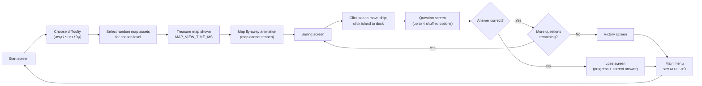

# Island of the Lost Memory (אי הזיכרון האבוד) 🏴‍☠️

**WEB course project — static HTML5 memory game in Hebrew (RTL)**

## About the game

*Island of the Lost Memory* is a browser-based memory game with a pirate treasure-hunt theme. The player studies a treasure map for a limited time, memorizing visual clues (animals, flags, volcanoes, food, and more). When the wind blows the map away, it cannot be reopened. The player sails between islands and answers multiple-choice questions based on what they remember from the map. A correct answer advances to the next island; one wrong answer ends the run. Completing all questions leads to victory.

Each run is randomized: the game picks a subset of map images and generates a matching question route from the same asset pool. Difficulty controls how many clues appear on the map and how many questions are asked. The experience is fully in Hebrew, with right-to-left layout throughout.

**Live demo:** [https://igavriel.github.io/island-of-forgotten-memory/](https://igavriel.github.io/island-of-forgotten-memory/)

## Students

- [Ilan Gavriel](https://github.com/igavriel)
- [Nitzan Kravitz](https://github.com/Nitz200)

**Roles**

- Game design — Nitzan Kravitz, Ilan Gavriel
- UI/UX design — Nitzan Kravitz
- Game development — Ilan Gavriel

## Project goal

Build a complete, playable memory game as a **static website** that runs without a server, install step, or build tool. The code is organized into small, readable JavaScript modules suitable for a WEB course assignment: configuration and data are separate from game logic, rendering, and screen flow.

## Agentic development workflow

This project was built with **Cursor Plan mode and Agent mode** working together. Every meaningful change followed the same cycle: plan first, review and correct the plan, then implement, then review the results. The agent does not replace the team; it accelerates work under explicit project rules that keep the codebase static, readable, and suitable for a WEB course.

**Standard cycle (per task)**

1. **Plan mode** — students describe a goal in natural language (for example: “add per-category island images” or “split debug tools into a separate module”). The agent explores the repo and produces a written plan: affected files, steps, risks, and what stays unchanged.
2. **Plan review** — students read the plan, check it against game design and course constraints, and confirm or challenge assumptions before any code is written.
3. **Plan correction** — the plan is refined based on feedback (scope trimmed, approach changed, edge cases added). This step repeats until the plan is acceptable.
4. **Implementation (Agent mode)** — only after the plan is approved, the agent edits files in small, focused diffs and runs checks. No full rewrites unless explicitly requested.
5. **Results review** — students test in the browser (`index.html`, `test.html`), request fixes if needed, and approve commits. Game design, UX, Hebrew content, and final submission quality remain the students’ responsibility.

If results review finds gaps, the cycle restarts from plan mode for the next correction — not from ad-hoc patching without a plan.

**Project guardrails (agent instructions)**

| Resource | Purpose |
| --- | --- |
| [AGENTS.md](AGENTS.md) | Top-level instructions for AI agents working on this repo |
| `.cursor/rules/` | Always-on constraints: static site only, Hebrew RTL, gameplay flow, Conventional Commits, docs workflow |
| `.cursor/skills/` | Task-specific guides (for example game architecture and asset/question structure) |

These files are **development metadata only** — they are not loaded by the game at runtime.

**Practices used throughout the project**

- **Small scoped changes** — preserve existing behavior unless a task explicitly changes it.
- **Living documentation** — `docs/progress.md`, `docs/decisions.md`, `docs/changelog.md`, and `docs/next-steps.md` updated as the prototype evolved.
- **Conventional Commits** — clear, reviewable git history (`feat`, `fix`, `refactor`, `docs`, …).
- **Smoke tests** — `test.html` runs automated browser checks after structural changes.
- **Debug isolation** — developer tools (`DEBUG_MODE`, layout picker) live in `js/devTools.js` and stay off for presentation.

## Technologies

This project uses only standard web technologies. No frameworks, bundlers, npm packages, or backend.

| Technology | Role in this project |
| --- | --- |
| **HTML5** | Single entry page (`index.html`); Hebrew RTL document (`lang="he"`, `dir="rtl"`); script tags load modules in a fixed order |
| **CSS3** | Layout, RTL styling, responsive 16:9 viewport, screen transitions, hover/focus states, and CSS-only animations (map reveal, answer feedback, win celebration). `prefers-reduced-motion` is supported |
| **Vanilla JavaScript** | Game state, question generation, DOM rendering, point-and-click sailing, map timer, and screen transitions — split across focused `.js` files with global functions (no classes or frameworks) |
| **Static assets** | PNG/JPG/SVG images for map clues, islands, backgrounds, and endings; loaded via `` and CSS `background-image` (no `fetch()` for local data) |
| **GitHub Pages** | Static hosting for the live demo |
| **Cursor (Plan + Agent mode)** | Plan → review → correction → implementation → results review; guided by [AGENTS.md](AGENTS.md) and `.cursor/` rules; not a runtime dependency |

**Architectural choices**

- Data lives in `.js` files (`config/config.js`, `config/assets.js`) so the game works when opened directly from disk (`file://`).
- Answer buttons may be shuffled on screen; the game always compares the player's choice using the **original option index**, not the displayed position.
- Debug and layout-tuning tools are isolated in `js/devTools.js` and disabled in production (`DEBUG_MODE: false`).

## How to run

No install, server, npm, or build step is required.

1. **Local:** open `index.html` directly in a browser (`file://`).
2. **Online:** use the [GitHub Pages demo](https://igavriel.github.io/island-of-forgotten-memory/) or host the project folder on any static file server.

The game works from `file://` because game data is embedded in JavaScript files and the project does not use `fetch()` for local JSON.

### Smoke tests

Open `test.html` in a browser to run automated checks (geometry, question routing, config, module globals, `startGame`, and static asset loading). Click **Run again** after changes. Results also appear in the browser console.

## Documentation

Project documentation lives in the [`docs/`](docs/) folder. Start here:

**[docs/README.md](docs/README.md)** — index of all project docs and the documentation workflow.

| Document | Contents |
| --- | --- |
| [docs/progress.md](docs/progress.md) | Current status: what works, what is partial, known limits |
| [docs/decisions.md](docs/decisions.md) | Locked-in design and technical decisions |
| [docs/changelog.md](docs/changelog.md) | Dated list of meaningful changes |
| [docs/assets.md](docs/assets.md) | How to add and organize image assets and question data |
| [docs/playtest.md](docs/playtest.md) | Manual playtesting and balancing guide |

## Game flow

Plain-text overview of one full run:

1. **Start screen** — the player chooses a difficulty level (קל / בינוני / קשה).
2. **Map phase** — the game randomly selects map images for that difficulty and displays them on the treasure map for `MAP_VIEW_TIME_MS` milliseconds.
3. **Map closes** — a fly-away animation removes the map; it cannot be viewed again.
4. **Sailing** — the player clicks the sea to move the ship and clicks the destination island to dock and open the next question.
5. **Question** — an island character asks a multiple-choice question (up to four shuffled options) based on a map clue from the same category.
6. **Advance or lose** — a correct answer moves to the next island; a wrong answer shows the loss screen with progress and the correct answer.
7. **End** — completing all questions shows the victory screen. The **לתפריט הראשי** button returns to the start screen for a new randomized run.



```
Start → Map (memorize) → Map flies away → Sail → Question → … → Win or Lose → Main menu
```

## Code structure

Scripts load in dependency order (see `index.html`):

| File | Responsibility |
| --- | --- |
| `config/config.js` | Game settings (timings, difficulty, map layout, sailing layout) |
| `config/assets.js` | Categorized image assets, Hebrew questions, and category metadata |
| `js/utils.js` | Generic helpers (shuffle, random pick, clamp) |
| `js/layoutGeometry.js` | Percent-based rectangle/circle math for layouts and hit testing |
| `js/gameLogic.js` | Random map asset selection and question route generation |
| `js/devTools.js` | Debug mode, sailing layout picker, developer UI (off in production) |
| `js/renderer.js` | DOM rendering for all screens |
| `js/gameState.js` | Game state and screen transitions |
| `js/main.js` | Bootstrap on `DOMContentLoaded` |
| `js/smokeTests.js` | Automated smoke tests (loaded by `test.html` only) |

```text
index.html
test.html              # browser smoke-test page
config/
  config.js            # game settings
  assets.js            # categorized assets and question data
css/
  style.css            # main game styles
  devTools.css         # debug and layout-tuning styles
  test.css             # smoke-test page styles
js/
  utils.js
  layoutGeometry.js
  gameLogic.js
  devTools.js
  renderer.js
  gameState.js
  main.js
  smokeTests.js
docs/                  # project documentation (see docs/README.md)
assets/                # images (map, islands, characters, endings, UI)
```

## Configuration

Edit [config/config.js](config/config.js).

| Setting | Purpose |
| --- | --- |
| `MAP_VIEW_TIME_MS` | How long the map is visible |
| `MAP_FLY_FRAMES` | Ordered sprite images for the map fly-away |
| `MAP_FLY_FRAME_MS` | Milliseconds per fly-away frame |
| `SAILING_SHIP_TRAVEL_MS` | Ship movement duration per sea/island click |
| `SAILING_LAYOUT` | Sea rectangle (`x`, `y`, `widthPercent`, `heightPercent`); island/ship/dock circles (`x`, `y`, `sizePercent`) |
| `SAILING_SHOW_LAYOUT_GUIDES` | Show dashed tuning guides on the sailing screen |
| `SAILING_LAYOUT_PICKER` | Dev mode: click the sailing scene to log layout values to the console |
| `ANSWER_FEEDBACK_MS` | Delay after answer click feedback |
| `LOSE_SCREEN_IMAGE` | Shared full-screen background for every wrong answer |
| `QUESTION_BACKGROUND_IMAGE` | Fallback island sprite when a category omits `islandImage` |
| `DEBUG_MODE` | Shows correct answers and a skip button; keep `false` for final presentation |
| `DIFFICULTY_LEVELS` | Difficulty labels plus image/question counts |
| `REQUIRED_MAP_CATEGORY` | Category that must appear on every generated map |
| `MAP_ASSET_LAYOUT` | Relative `x`, `y`, and `sizePercent` map placement per category |

Default difficulty levels:

| Level | Pictures on map | Questions per run |
| --- | ---: | ---: |
| קל (easy) | 3 | 5 |
| בינוני (medium) | 5 | 5 |
| קשה (hard) | 7 | 7 |

## Asset and question data

Edit [config/assets.js](config/assets.js). See also [docs/assets.md](docs/assets.md).

Each category in `ASSET_CATEGORIES` defines Hebrew copy, island art, and an asset pool:

```javascript
{
  question1: "איזה דגל הופיע במפה?",
  question2: "צבע הבד של הדגל?",
  islandImage: "assets/islands/mountain_05.png",
  islandEmoji: "🚩",
  islandTitle: "שאלת הדגלים",
  characterEmoji: "⚓",
  characterName: "קצין הדגלים",
  failTitle: "הדגל הונף לא נכון!",
  assets: FLAG_FILES,
}
```

Each asset in the pool links an image path to two possible answers:

```javascript
{
  category: "flag",
  path: "assets/characters/flag_0005.png",
  answer1: "דגל עורב",
  answer2: "לבן",
}
```

The game engine picks a random asset per category for the map, then builds questions from the selected assets. Distractors are other unique answers from the same category. The engine does not hardcode specific asset content.

## Notes for reviewers

- All user-facing text is Hebrew; layout is RTL.
- The site is fully static — no backend, database, or build pipeline.
- Questions are generated at runtime from `config/assets.js`, not from a fixed hardcoded list.
- Image paths are optional: missing or broken files fall back to emoji/text placeholders.
- Code was developed with **Cursor Plan + Agent mode** (plan, review, correct, implement, review results) under explicit project rules ([AGENTS.md](AGENTS.md)); students directed, tested, and own the submitted work.
