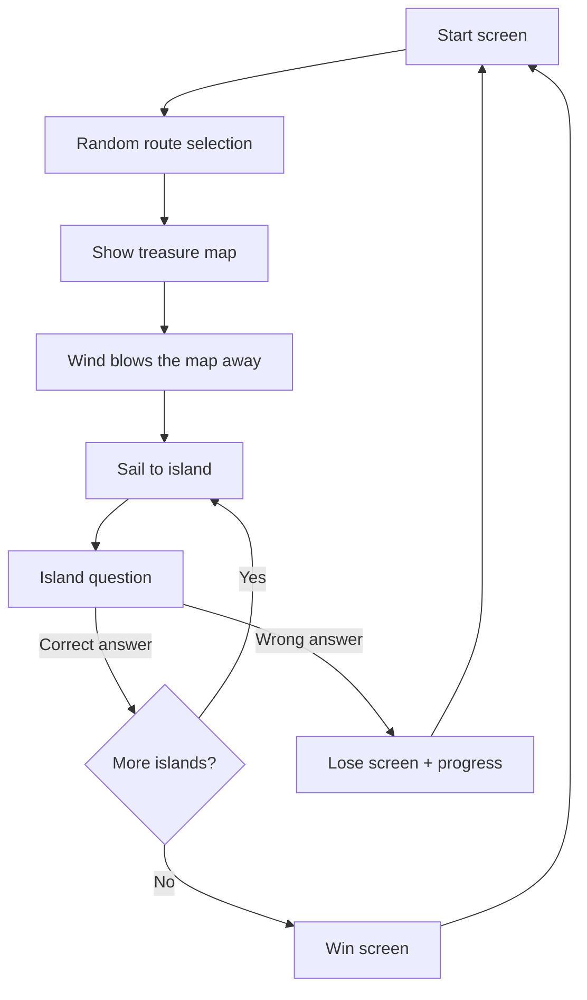

# Island of the Lost Memory (אי הזיכרון האבוד) 🏴‍☠️

A point-and-click pirate memory game, in Hebrew with an RTL layout.
The site is fully static: HTML, CSS, and vanilla JavaScript — no server, no npm, and no build step.

> The game UI is in Hebrew. This README is in English, but the code comments and on-screen text are intentionally kept as-is (comments in English, UI in Hebrew).

## Project goal

The player views a treasure map for a configurable time (10 seconds by default). The map contains
visual memory clues in route order. Then the wind blows the map away and it can never be seen again.
The player sails between random islands, and on each island a character asks a 4-option question based
on one of the map clues. A correct answer advances to the next island. A wrong answer ends the game with
an island-specific lose screen and a progress score. Completing all islands shows a victory screen.

## How to run

No installation, server, or build tools required.

1. **The simple way:** open `index.html` directly in a browser (double-click / `file://`).
2. **Static hosting:** upload the whole folder to GitHub Pages or any static hosting provider, then open the URL.

The game also works from `file://` because all data lives in JavaScript files (no use of `fetch()`).

## File structure

```
index.html          # Page shell, script load order, RTL layout
README.md           # This file
css/style.css       # Layout, RTL, and CSS animations
js/config.js        # CONFIG — all settings
js/riddles.js       # RIDDLES — the riddle pool (data only)
js/utils.js         # Fisher-Yates shuffle and route selection
js/gameState.js     # Game state and game flow
js/renderer.js      # DOM rendering (all screens)
js/main.js          # Game bootstrap
docs/               # Progress docs + asset integration guide (docs/assets.md)
assets/             # Image assets (placeholders for now)
  hints/            #   map clue images
  islands/          #   island background images
  characters/       #   questioner images
  endings/          #   lose/win images
  ui/               #   shared UI images
  map/              #   treasure map backgrounds
```

Images are optional and off by default (`CONFIG.USE_IMAGE_ASSETS = false`); the game uses
emoji/text placeholders. To add real images later, see [docs/assets.md](docs/assets.md).

Separation of concerns: `config` (settings), `riddles` (content), `utils` (helpers), `gameState` (state/flow),
`renderer` (rendering), `main` (bootstrap). The game engine does not depend on any specific riddle content.

## Game flow (text explanation)

1. **Start screen** — click "Start the adventure".
2. **Route selection** — `NUMBER_OF_ISLANDS` riddles are selected and shuffled from the pool.
3. **Treasure map** — the selected riddles are shown, *in the same order* they will be asked on the islands. This is the player's memory source.
4. **Wind blows the map away** — after `MAP_VIEW_TIME_MS` the map is gone and cannot be reopened.
5. **Sailing** — a transition animation to the next island.
6. **Island question** — a character asks a question with 4 answer buttons (display order is shuffled).
7. **Correct answer** → sail to the next island. **Wrong answer** → lose screen with progress (island X of Y).
8. **All islands completed** → win screen.
9. **Play again** → starts a new game with a fresh random route.

### Flow diagram (Mermaid — may not render everywhere)



### Flow diagram (plain text — always works)

```
Start -> route selection -> map -> wind blows -> sailing -> question
question --(correct)--> more islands? --(yes)--> sailing
question --(correct)--> more islands? --(no)--> win
question --(wrong)--> lose (island X of Y)
lose / win -> play again -> start
```

## Configuration options (`js/config.js`)

| Setting | Default | Description |
|---------|---------|-------------|
| `NUMBER_OF_ISLANDS` | `5` | How many riddles are selected from the pool per game |
| `MAP_VIEW_TIME_MS` | `10000` | Map display time in milliseconds (10 seconds) |
| `SAILING_TIME_MS` | `1800` | Duration of the sailing animation |
| `SHOW_HINT_LABELS_ON_MAP` | `true` | Show a text label next to the emoji on the map (final version: `false`) |
| `USE_IMAGE_ASSETS` | `false` | Use image files where a riddle provides a path, with fallback to emoji/text placeholders. See [docs/assets.md](docs/assets.md) |
| `DEBUG_MODE` | `false` | Debug mode: marks the correct answer and adds a skip button. **Must be `false` for the final presentation** |
| `SHOW_CORRECT_ANSWER_ON_LOSS` | `true` | Show the correct answer on the lose screen (balancing option; see [docs/playtest.md](docs/playtest.md)) |

### Changing map time and island count

Edit `js/config.js`:

```javascript
const CONFIG = {
  NUMBER_OF_ISLANDS: 5,      // play 5 islands
  MAP_VIEW_TIME_MS: 7000,    // show the map for 7 seconds
  // ...
};
```

## How to add a riddle

Add a new object to the `RIDDLES` array in `js/riddles.js`. No other file needs to change —
the engine selects riddles from the pool automatically.

```javascript
{
  id: "shark",
  hintEmoji: "🦈",
  hintLabel: "כריש",
  question: "איזה יצור שחה סביב הספינה במפה?",
  options: ["דולפין", "כריש", "צב", "לווייתן"],
  correctIndex: 1,                 // the original index of the correct answer in options
  islandTitle: "אי הכריש",
  characterName: "הדייג הזקן",
  failTitle: "נשמרת!",
  failText: "כריש אפור שחה סביב הספינה במפה.",
}
```

Content rules: exactly 4 options, exactly one correct answer, and a clear visual clue that connects
directly to the question. `correctIndex` is always the index within `options` *before* shuffling —
the shuffle happens only in the display.

## Replacing placeholders with images later

The prototype uses emoji and text labels. In the final version:

1. Add optional image fields to each riddle: `hintImage`, `islandBackgroundImage`,
   `characterImage`, `loseImage` (paths to files inside `assets/`).
2. Update `renderer.js` to render an `` instead of the emoji when the field exists.
3. Set `SHOW_HINT_LABELS_ON_MAP = false` so the map shows visual clues only.

## Known limitations (first prototype)

- No real images — emoji and placeholders only.
- No score/progress persistence between games (no server/database).
- No sound.
- Data is loaded from `.js` files (not external JSON), to support running from `file://`.
- The riddle pool is relatively small; add more riddles for more varied games.
